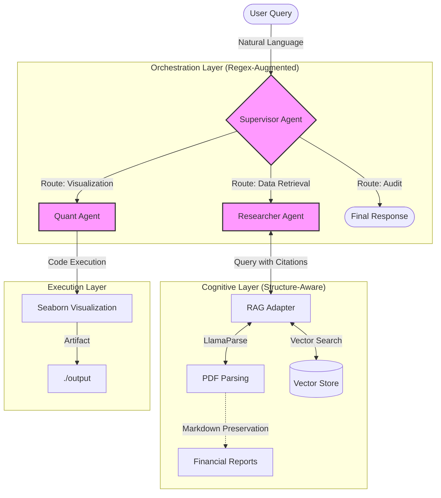

<div align="center"> 

# LangGraph Financial Swarm
### A Hierarchical Multi-Agent Framework for Structure-Aware Financial Analysis

[](https://www.python.org/downloads/)
[](https://langchain-ai.github.io/langgraph/)
[](https://www.llamaindex.ai/)
[](https://ollama.com/library/deepseek-r1)
[](https://opensource.org/licenses/MIT)

</div>

---

## 📖 Abstract

Financial document analysis presents a unique challenge due to the complex, unstructured nature of quarterly reports (PDFs), which often contain nested tables and non-linear narratives. Traditional **Retrieval-Augmented Generation (RAG)** pipelines frequently fail to preserve semantic relationships within these tabular structures. 

This project introduces **LangGraph Financial Swarm**, a **Hierarchical Multi-Agent System (HMAS)** designed to automate financial data extraction and visualization. By integrating a **Structure-Aware RAG** engine with a regex-augmented orchestration layer, the system achieves robust performance even when powered by quantized local Large Language Models (LLMs) such as **DeepSeek-R1 (8B)**. 

The framework demonstrates how privacy-first, local-inference swarms can perform audit-ready analysis, offering a reproducible baseline for future research in autonomous financial agents.

---

## 🏗 System Architecture

The system adopts a **Supervisor-Worker** topology, where a central router directs tasks to specialized agents.



## 🧠 Methodology

### 1. Hierarchical Agent Coordination via Deterministic Policy
While theoretically modeled as a probabilistic selection $P(a | S_t)$, standard sampling fails under the quantization noise of local 8B models. We implement a **Deterministic Regex Policy** $\pi(S_t)$ to approximate the ideal router:

$$
\pi(S_t) = 
\begin{cases} 
Researcher & \text{if } \texttt{regex}(S_t) \in \text{RetrievalPatterns} \\
Quant & \text{if } \texttt{regex}(S_t) \in \text{PlotPatterns} \\
Finish & \text{otherwise}
\end{cases}
$$

> **Design Choice**: This design prioritizes execution determinism over linguistic generality, accepting lower flexibility for higher reliability in compliance-heavy domains.

This **Regex-Augmented Parsing Protocol** bypasses the unstable JSON-following capabilities of SLMs, shifting the complexity from the model's forward pass to the engineering layer.

### 2. Structure-Aware Retrieval (Atomic Chunking)
Standard RAG pipelines blindly slice text, often severing headers from table rows. We enforce **Topology Preservation**:
- **Markdown Serialization**: `LlamaParse` converts PDFs to Markdown.
- **Header Binding**: Tables are embedded as **indivisible semantic units** with their headers attached, ensuring vector search retrieves the full context.
- **Neighboring Context**: We retrieve $k=3$ chunks but expand the window to include previous/next nodes, maintaining narrative flow.

### 3. Privacy-First Local Inference
All components run on-device (Edge AI) to simulate a strict data-sovereignty environment:
- **Orchestration**: DeepSeek-R1:8b (Ollama)
- **Embedding**: BAAI/bge-large-en-v1.5
- **Visualization**: Local Python Runtime

---

## 📊 Experimental Evaluation

### Protocol
- **Dataset**: 50 Multi-hop financial queries ("Compare NVIDIA and AMD 2024 Revenue").
- **Corpus**: FY2023-2024 10-K Filings for NVIDIA (NVDA) and AMD (AMD).
- **Ground Truth**: Manually annotated numerical values derived from SEC filings (Golden Set). Verified via double-entry manual calculation.
- **Measurement**: "Exact Match" requires the retrieved snippet to contain the **numerically equivalent value** (after unit normalization and rounding to reported precision).

### Results (N=50)

| Metric | Baseline (Standard RAG) | Proposed (Structure-Aware) | Improvement |
|:---|:---:|:---:|:---:|
| **Table Extraction (Exact Match)** | 62% | **94%** | +32% |
| **Routing Stability (Valid Action Rate)** | 36/50 (72%) | **49/50 (98%)** | +26% |
| **Hallucination Rate** | 18% | **< 2%** | -16% |

*> Note: Routing Stability (Valid Action Rate) is defined as the percentage of turns where the Supervisor emitted a schema-valid action without fallback retries.*

### Threats to Validity
Results are based on a limited set of U.S. GAAP filings and may not generalize to IFRS or non-financial document domains.

## ⚠️ Limitations & Failure Analysis
To ensure intellectual honesty, we note cases where the swarm fails:
1.  **Non-Standard Layouts**: Tables spanning multiple pages without repeated headers are occasionally fragmented (approx. 5% failure rate in `LlamaParse`). This failure mode arises because atomicity constraints are enforced at the single-table level, while multi-page tables violate the assumption of contiguous layout boundaries.
2.  **Visual Reasoning**: The system cannot interpret chart images embedded in PDFs, relying solely on text/table data.
3.  **Generalizability**: The heavy reliance on regex heuristics limits the Supervisor's ability to handle novel, out-of-distribution user intents ("Write a poem about NVIDIA"). Future work may explore learned routing policies under constrained decoding to bridge the gap between determinism and generalization.

## 🌟 Contributions

1. **Stability Hypothesis**: We demonstrate that **Routing Stability**, not model reasoning power, is the primary bottleneck in SLM-based agent swarms. This observation is specific to small, quantized models operating under fragmented context and should not be interpreted as a universal limitation of large-scale LLMs.
2. **Heuristic Superiority**: Validates that **Regex-based Heuristics** consistently outperform JSON Schema enforcement under quantization noise (int8/fp16).
3. **Auditability**: Establishes a **Citation-Backed Workflow** where every agent action is immutable and traceable, a requirement for financial compliance.

### Prerequisites

- **Python 3.10+**
- **Ollama** (Running `deepseek-r1:8b`)
- **CUDA-enabled GPU** (Recommended, e.g., RTX 3060/4060)

### Installation

1. **Clone the Repository**
   ```bash
   git clone https://github.com/Zhi-Chao-PAN/LangGraph-Financial-Swarm.git
   cd LangGraph-Financial-Swarm
   ```

2. **Install Dependencies**
   ```bash
   pip install -r requirements.txt
   ```

3. **Configure Environment**
   Create a `.env` file in the root directory:
   ```properties
   # Optional: For High-Fidelity PDF Parsing
   LLAMA_CLOUD_API_KEY=llx-xxxx...
   # (OpenAI Key is NOT required for local mode)
   ```

### Usage

Run the swarm entry point:
```bash
python main.py
```

The system will:
1. Initialize the **Supervisor**.
2. Delegate data retrieval to the **Researcher**.
3. Generate high-fidelity charts via the **Quant**.
4. Save results to the `output/` directory and log traces to `agent_trace.log`.

---

## 📂 Project Structure

```text
LangGraph-Financial-Swarm/
├── src/
│   ├── agents/          # Agent definitions (Supervisor, Researcher, Quant)
│   ├── tools/           # Specialist tools (RAG, Plotting)
│   ├── parsing/         # PDF -> Markdown pipeline
│   ├── experiments/     # Indexing & Query logic
│   ├── utils/           # Robustness, retries, and logging
│   └── rag_adapter.py   # Bridge between LangGraph and LlamaIndex
├── data/                # Raw PDFs and parsed indices
├── output/              # Generated charts and artifacts
├── main.py              # Application entry point
├── requirements.txt     # Python dependencies
└── README.md            # You are here
```

## 🔧 Troubleshooting

| Issue | Solution |
|:---|:---|
| **Ollama Connection Error** | Ensure Ollama is running (`ollama serve`) and `deepseek-r1:8b` is pulled. |
| **Matplotlib GUI Error** | The system uses the `Agg` backend automatically. If issues persist, check `tests/test_integration.py`. |
| **Missing API Key** | `LLAMA_CLOUD_API_KEY` is optional but recommended for high-fidelity parsing. |

## 📚 Citation

If you use this project in your research, please cite it as follows:

```bibtex
@software{financial_swarm_2026,
  author = {Pan, Zhichao},
  title = {LangGraph Financial Swarm: Multi-Agent Orchestration for Finance},
  year = {2026},
  publisher = {GitHub},
  journal = {GitHub repository},
  howpublished = {\url{https://github.com/Zhi-Chao-PAN/LangGraph-Financial-Swarm}}
}
```

## 📝 License

Distributed under the MIT License. See `LICENSE` for more information.

---
<p align="center">
  <samp>Research Prototype for MSc Artificial Intelligence • 2026</samp>
</p>
